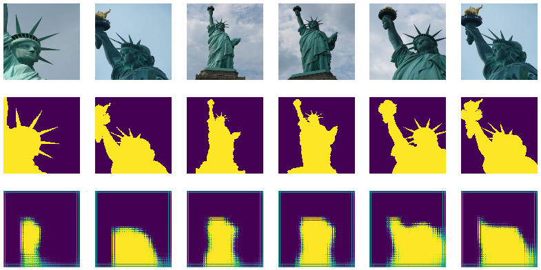

# group-wise-iccv19
Pytorch implementation of: "[Group-Wise Deep Object Co-Segmentation With Co-Attention Recurrent Neural Network](http://openaccess.thecvf.com/content_ICCV_2019/html/Li_Group-Wise_Deep_Object_Co-Segmentation_With_Co-Attention_Recurrent_Neural_Network_ICCV_2019_paper.html)" - Li et al. of ICCV 2019 

**This code is just a POC and overfits a single group of images. Please adjust it to fit your needs.**




## Run on Colab

Here's a [colab]() for you.


## Run locally

The best way to run in three steps is with Docker.

1. `git clone https://github.com/francesco-p/group-wise-iccv19.git`
2. `cd group-wise-iccv19`
3. `sudo docker run --rm --gpus all -it -v $(pwd):/current ufoym/deepo bash`
4. `python main.py`

You don't have Docker? There I produced a `requiremets.txt` but I didn't test it.


## Folder structure

```
.
├1─ data
│   └── 042_reproducible
│       ├── ground_truth
│       │   ├── 369293688_87888a7a6c.png
│       │   └── ...
│       └── images
│           ├── 369294302_18dca2ab5b.jpg
│           └── ...
├── LICENSE
├2─ main.py
├── README.md
└3─ src
    ├4─ dataloader.py
    ├── __init__.py
    ├5─ models.py
    └6─ utils.py
```

1. `data/`: the data folder, here you have the tiny group of images overfitted
2. `main.py`: the main script, implements the training loop and losses
3. `src/`: source folder with classes
4. `dataloader.py`: class which implements iCoseg dataset
5. `models.py`: it contains SIR, CARU and MFF implementations
6. `utils.py`: it contains utilities for debug and tensorboard stuff


## Considerations

I found the method very difficult to train, in fact i couldn't get good results on iCoseg dataset.
